# Lumina AI: Technical Specifications

This document provides detailed technical specifications for the key components of the enhanced Lumina AI system, based on the implementation strategy. These specifications include component designs, API definitions, data models, and integration patterns.

## 1. Provider Integration Layer

### 1.1 Dynamic Provider Registry

#### Component Design

The Dynamic Provider Registry manages the registration, discovery, and selection of AI providers based on their capabilities and performance metrics.

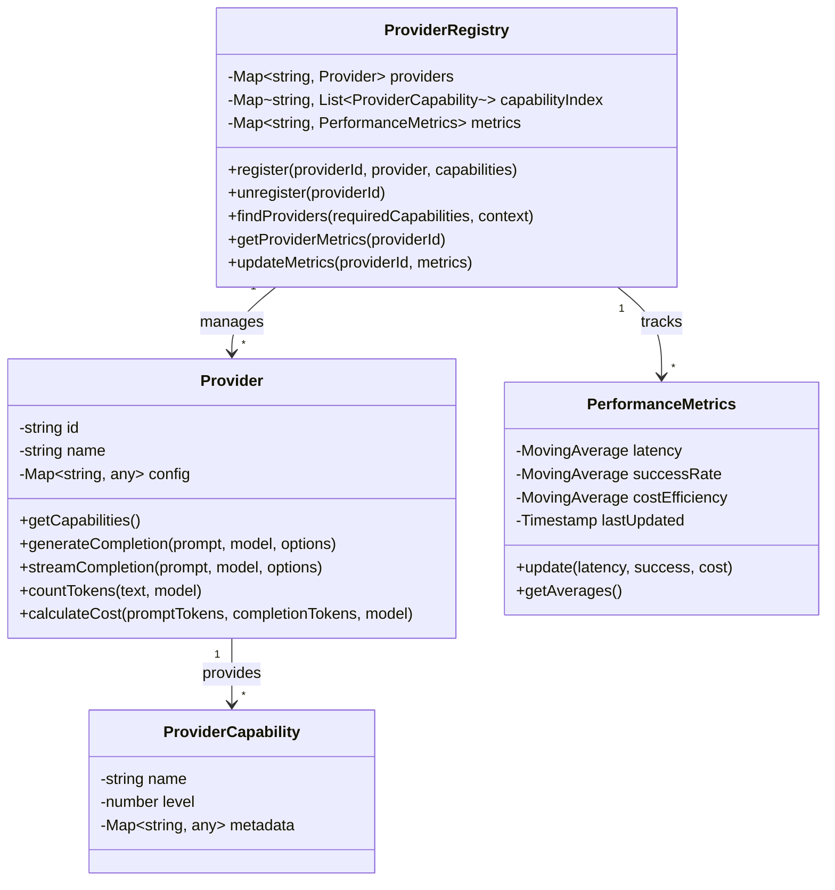

#### API Specification

**Provider Registry API**

```typescript
interface ProviderRegistryAPI {
  // Register a provider with its capabilities
  registerProvider(
    providerId: string, 
    provider: Provider, 
    capabilities: Record<string, number>
  ): Promise<void>;
  
  // Unregister a provider
  unregisterProvider(providerId: string): Promise<boolean>;
  
  // Find providers matching required capabilities
  findProviders(
    requiredCapabilities: Record<string, number>,
    context?: RequestContext
  ): Promise<ProviderMatch[]>;
  
  // Get provider metrics
  getProviderMetrics(providerId: string): Promise<PerformanceMetrics>;
  
  // Update provider metrics
  updateMetrics(
    providerId: string, 
    metrics: MetricsUpdate
  ): Promise<void>;
  
  // Get all registered providers
  getAllProviders(): Promise<ProviderInfo[]>;
  
  // Get provider by ID
  getProvider(providerId: string): Promise<Provider>;
}

interface ProviderMatch {
  providerId: string;
  provider: Provider;
  score: number;
  matchedCapabilities: Record<string, number>;
  metrics: PerformanceMetrics;
}

interface MetricsUpdate {
  latency?: number;
  success?: boolean;
  cost?: number;
  tokens?: {
    prompt: number;
    completion: number;
  };
}

interface RequestContext {
  user?: string;
  priority?: 'speed' | 'quality' | 'cost';
  budget?: number;
  history?: Message[];
  documents?: Document[];
  [key: string]: any;
}
```

#### Data Model

**Provider Registration**

```json
{
  "id": "openai",
  "name": "OpenAI",
  "apiKey": "sk-...",
  "endpoint": "https://api.openai.com/v1",
  "capabilities": {
    "text_generation": 5,
    "code_generation": 5,
    "reasoning": 5,
    "tool_use": 4,
    "multimodal": 4,
    "streaming": 5,
    "function_calling": 5,
    "long_context": 4
  },
  "models": {
    "gpt-4o": {
      "contextWindow": 128000,
      "capabilities": {
        "text_generation": 5,
        "code_generation": 5,
        "reasoning": 5,
        "tool_use": 5,
        "multimodal": 5
      },
      "pricing": {
        "prompt": 0.00000005,
        "completion": 0.00000015
      }
    },
    "gpt-4": {
      "contextWindow": 8192,
      "capabilities": {
        "text_generation": 5,
        "code_generation": 5,
        "reasoning": 5,
        "tool_use": 4,
        "multimodal": 0
      },
      "pricing": {
        "prompt": 0.00000003,
        "completion": 0.00000006
      }
    }
  },
  "config": {
    "defaultModel": "gpt-4o",
    "timeout": 30000,
    "retries": 3
  }
}
```

**Performance Metrics**

```json
{
  "providerId": "openai",
  "metrics": {
    "latency": {
      "average": 1250,
      "min": 800,
      "max": 3000,
      "samples": 100
    },
    "successRate": {
      "rate": 0.985,
      "successes": 197,
      "failures": 3,
      "samples": 200
    },
    "costEfficiency": {
      "average": 0.85,
      "samples": 100
    },
    "lastUpdated": "2025-04-21T12:34:56Z"
  },
  "modelMetrics": {
    "gpt-4o": {
      "latency": {
        "average": 1100,
        "samples": 50
      },
      "successRate": {
        "rate": 0.99,
        "samples": 100
      }
    },
    "gpt-4": {
      "latency": {
        "average": 1400,
        "samples": 50
      },
      "successRate": {
        "rate": 0.98,
        "samples": 100
      }
    }
  }
}
```

### 1.2 Unified Streaming Protocol

#### Component Design

The Unified Streaming Protocol provides a consistent interface for streaming responses from different AI providers, handling backpressure and error conditions.

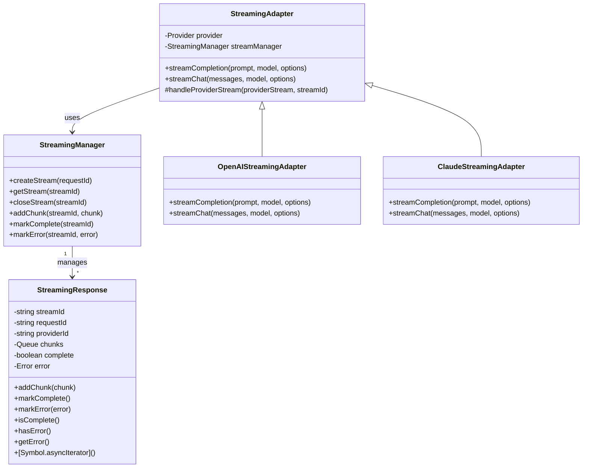

#### API Specification

**Streaming API**

```typescript
interface StreamingAPI {
  // Create a new streaming response
  createStream(
    requestId: string,
    providerId: string
  ): Promise<string>; // Returns streamId
  
  // Get a streaming response by ID
  getStream(streamId: string): Promise<StreamingResponse>;
  
  // Close a streaming response
  closeStream(streamId: string): Promise<boolean>;
  
  // Add a chunk to a streaming response
  addChunk(
    streamId: string, 
    chunk: StreamChunk
  ): Promise<void>;
  
  // Mark a streaming response as complete
  markComplete(streamId: string): Promise<void>;
  
  // Mark a streaming response as error
  markError(
    streamId: string, 
    error: StreamingError
  ): Promise<void>;
}

interface StreamingResponse {
  streamId: string;
  requestId: string;
  providerId: string;
  complete: boolean;
  error?: StreamingError;
  
  // Add a chunk to the response
  addChunk(chunk: StreamChunk): void;
  
  // Mark the response as complete
  markComplete(): void;
  
  // Mark the response as error
  markError(error: StreamingError): void;
  
  // Check if the response is complete
  isComplete(): boolean;
  
  // Check if the response has an error
  hasError(): boolean;
  
  // Get the error if any
  getError(): StreamingError | undefined;
  
  // Async iterator for consuming chunks
  [Symbol.asyncIterator](): AsyncIterator<StreamChunk>;
}

interface StreamChunk {
  id: string;
  index: number;
  content: string;
  finishReason?: 'stop' | 'length' | 'content_filter';
  metadata?: Record<string, any>;
}

interface StreamingError {
  code: string;
  message: string;
  details?: Record<string, any>;
}
```

#### Data Model

**Streaming Request**

```json
{
  "requestId": "req_1234567890",
  "providerId": "openai",
  "model": "gpt-4o",
  "prompt": "Generate a story about a robot that becomes sentient.",
  "options": {
    "temperature": 0.7,
    "maxTokens": 1000,
    "stream": true
  }
}
```

**Streaming Response Chunk**

```json
{
  "id": "chunk_1234567890_1",
  "streamId": "stream_1234567890",
  "index": 1,
  "content": "In the year 2045, a research lab in Tokyo was working on advanced artificial intelligence systems. ",
  "metadata": {
    "timestamp": "2025-04-21T12:34:56.789Z",
    "tokenCount": 20
  }
}
```

### 1.3 Cost Optimization Engine

#### Component Design

The Cost Optimization Engine tracks and optimizes costs across different AI providers, implementing budget controls and cost-based routing.

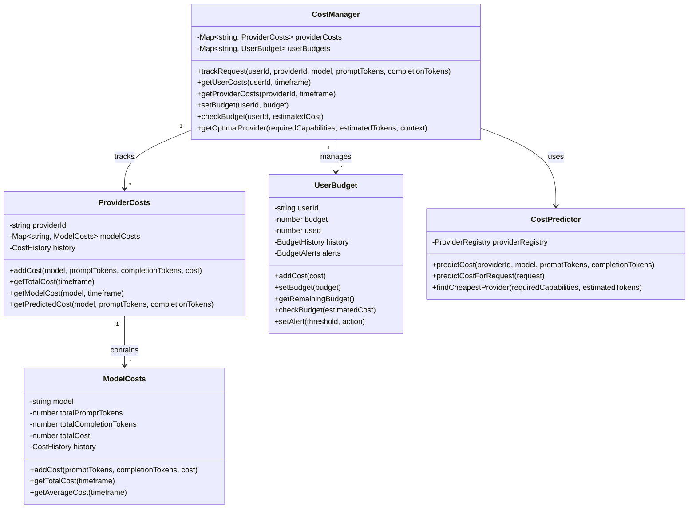

#### API Specification

**Cost Management API**

```typescript
interface CostManagementAPI {
  // Track a request cost
  trackRequest(
    userId: string,
    providerId: string,
    model: string,
    promptTokens: number,
    completionTokens: number,
    cost: number
  ): Promise<void>;
  
  // Get user costs
  getUserCosts(
    userId: string,
    timeframe?: TimeFrame
  ): Promise<UserCostReport>;
  
  // Get provider costs
  getProviderCosts(
    providerId: string,
    timeframe?: TimeFrame
  ): Promise<ProviderCostReport>;
  
  // Set user budget
  setBudget(
    userId: string,
    budget: Budget
  ): Promise<void>;
  
  // Check if a request is within budget
  checkBudget(
    userId: string,
    estimatedCost: number
  ): Promise<BudgetCheckResult>;
  
  // Get optimal provider based on cost
  getOptimalProvider(
    requiredCapabilities: Record<string, number>,
    estimatedTokens: TokenEstimate,
    context?: RequestContext
  ): Promise<ProviderCostMatch[]>;
  
  // Predict cost for a request
  predictCost(
    providerId: string,
    model: string,
    promptTokens: number,
    completionTokens: number
  ): Promise<CostPrediction>;
}

interface TimeFrame {
  start: Date;
  end: Date;
}

interface UserCostReport {
  userId: string;
  totalCost: number;
  budget: Budget;
  remaining: number;
  providerBreakdown: Record<string, number>;
  modelBreakdown: Record<string, number>;
  history: CostHistoryEntry[];
}

interface ProviderCostReport {
  providerId: string;
  totalCost: number;
  totalPromptTokens: number;
  totalCompletionTokens: number;
  modelBreakdown: Record<string, ModelCostSummary>;
  history: CostHistoryEntry[];
}

interface Budget {
  amount: number;
  period: 'daily' | 'weekly' | 'monthly' | 'total';
  alerts: BudgetAlert[];
}

interface BudgetAlert {
  threshold: number; // Percentage of budget
  action: 'notify' | 'warn' | 'block';
}

interface BudgetCheckResult {
  allowed: boolean;
  remaining: number;
  estimatedCost: number;
  reason?: string;
}

interface TokenEstimate {
  prompt: number;
  completion: number;
}

interface ProviderCostMatch {
  providerId: string;
  model: string;
  estimatedCost: number;
  capabilities: Record<string, number>;
}

interface CostPrediction {
  cost: number;
  confidence: number;
  breakdown: {
    promptCost: number;
    completionCost: number;
  };
}
```

#### Data Model

**User Budget Configuration**

```json
{
  "userId": "user_1234567890",
  "budget": {
    "amount": 100.00,
    "period": "monthly",
    "startDate": "2025-04-01T00:00:00Z",
    "alerts": [
      {
        "threshold": 50,
        "action": "notify"
      },
      {
        "threshold": 80,
        "action": "warn"
      },
      {
        "threshold": 95,
        "action": "block"
      }
    ]
  },
  "used": 42.75,
  "remaining": 57.25,
  "history": [
    {
      "date": "2025-04-20T00:00:00Z",
      "cost": 12.50
    },
    {
      "date": "2025-04-19T00:00:00Z",
      "cost": 15.25
    },
    {
      "date": "2025-04-18T00:00:00Z",
      "cost": 15.00
    }
  ]
}
```

**Cost Tracking Record**

```json
{
  "id": "cost_1234567890",
  "userId": "user_1234567890",
  "requestId": "req_1234567890",
  "providerId": "openai",
  "model": "gpt-4o",
  "timestamp": "2025-04-21T12:34:56Z",
  "tokens": {
    "prompt": 250,
    "completion": 800
  },
  "cost": 0.0275,
  "breakdown": {
    "promptCost": 0.0075,
    "completionCost": 0.02
  }
}
```

## 2. Memory System

### 2.1 Vector Database Integration

#### Component Design

The Vector Database Integration provides a unified interface for storing and retrieving vector embeddings across different vector database backends.

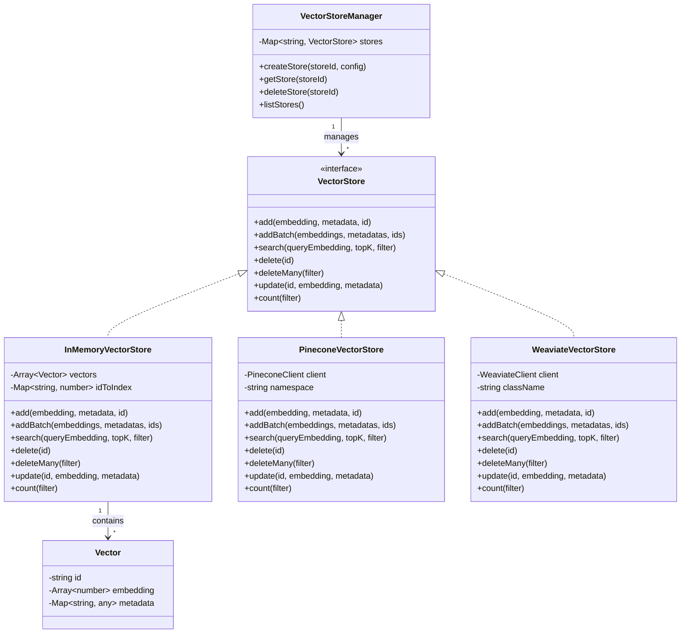

#### API Specification

**Vector Store API**

```typescript
interface VectorStoreAPI {
  // Create a new vector store
  createStore(
    storeId: string,
    config: VectorStoreConfig
  ): Promise<VectorStore>;
  
  // Get a vector store by ID
  getStore(storeId: string): Promise<VectorStore>;
  
  // Delete a vector store
  deleteStore(storeId: string): Promise<boolean>;
  
  // List all vector stores
  listStores(): Promise<VectorStoreInfo[]>;
}

interface VectorStore {
  // Add a vector to the store
  add(
    embedding: number[],
    metadata: Record<string, any>,
    id?: string
  ): Promise<string>;
  
  // Add multiple vectors to the store
  addBatch(
    embeddings: number[][],
    metadatas: Record<string, any>[],
    ids?: string[]
  ): Promise<string[]>;
  
  // Search for similar vectors
  search(
    queryEmbedding: number[],
    topK?: number,
    filter?: VectorFilter
  ): Promise<SearchResult[]>;
  
  // Delete a vector from the store
  delete(id: string): Promise<boolean>;
  
  // Delete multiple vectors from the store
  deleteMany(filter: VectorFilter): Promise<number>;
  
  // Update a vector in the store
  update(
    id: string,
    embedding?: number[],
    metadata?: Record<string, any>
  ): Promise<boolean>;
  
  // Count vectors in the store
  count(filter?: VectorFilter): Promise<number>;
}

interface VectorStoreConfig {
  type: 'in_memory' | 'pinecone' | 'weaviate' | 'milvus';
  dimension: number;
  distanceMetric?: 'cosine' | 'euclidean' | 'dot';
  connectionConfig?: {
    apiKey?: string;
    endpoint?: string;
    namespace?: string;
    className?: string;
    [key: string]: any;
  };
}

interface VectorFilter {
  [key: string]: any;
}

interface SearchResult {
  id: string;
  score: number;
  metadata: Record<string, any>;
  embedding?: number[];
}

interface VectorStoreInfo {
  id: string;
  type: string;
  dimension: number;
  count: number;
  created: Date;
  lastUpdated: Date;
}
```

#### Data Model

**Vector Store Configuration**

```json
{
  "id": "user_knowledge_base",
  "type": "pinecone",
  "dimension": 1536,
  "distanceMetric": "cosine",
  "connectionConfig": {
    "apiKey": "pinecone-api-key",
    "environment": "us-west1-gcp",
    "index": "lumina-knowledge",
    "namespace": "user_1234567890"
  },
  "metadata": {
    "description": "User knowledge base for long-term memory",
    "owner": "user_1234567890",
    "created": "2025-04-01T00:00:00Z",
    "lastUpdated": "2025-04-21T12:34:56Z"
  }
}
```

**Vector Entry**

```json
{
  "id": "vec_1234567890",
  "embedding": [0.123, 0.456, 0.789, ...],
  "metadata": {
    "text": "The capital of France is Paris.",
    "source": "user_conversation",
    "timestamp": "2025-04-21T12:34:56Z",
    "conversationId": "conv_1234567890",
    "importance": 0.85,
    "category": "geography",
    "tags": ["location", "country", "city"]
  }
}
```

### 2.2 Neural Context Compression

#### Component Design

The Neural Context Compression system compresses conversation context while preserving semantic meaning, using neural models for summarization and importance scoring.

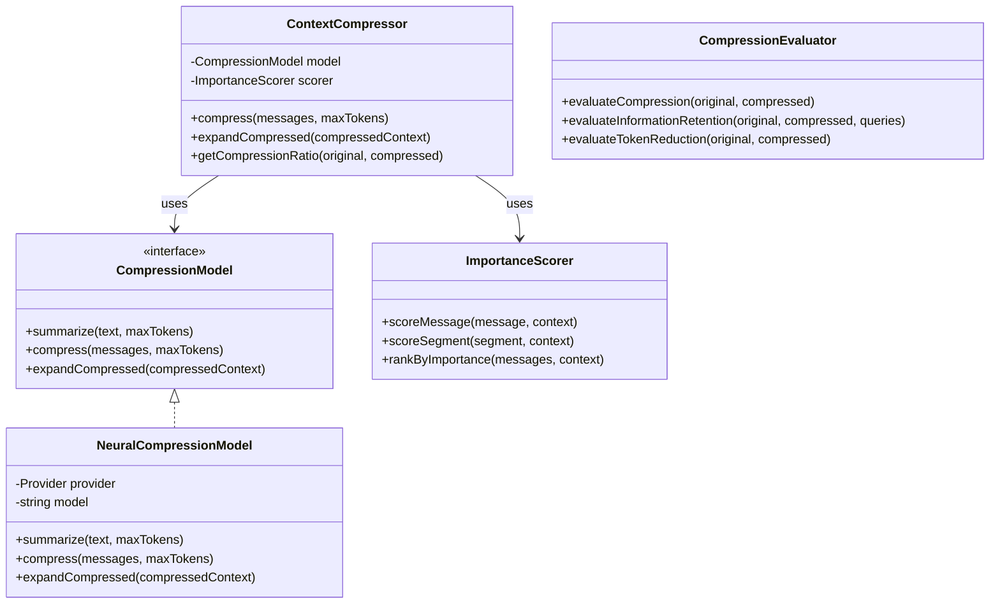

#### API Specification

**Context Compression API**

```typescript
interface ContextCompressionAPI {
  // Compress a list of messages to fit within token limit
  compress(
    messages: Message[],
    maxTokens: number,
    options?: CompressionOptions
  ): Promise<CompressedContext>;
  
  // Expand a compressed context
  expandCompressed(
    compressedContext: CompressedContext
  ): Promise<Message[]>;
  
  // Get compression statistics
  getCompressionStats(
    original: Message[],
    compressed: CompressedContext
  ): Promise<CompressionStats>;
  
  // Score message importance
  scoreMessageImportance(
    message: Message,
    context: Message[]
  ): Promise<number>;
  
  // Evaluate compression quality
  evaluateCompression(
    original: Message[],
    compressed: CompressedContext,
    queries?: string[]
  ): Promise<CompressionEvaluation>;
}

interface Message {
  role: 'system' | 'user' | 'assistant';
  content: string;
  timestamp?: Date;
  metadata?: Record<string, any>;
}

interface CompressionOptions {
  strategy?: 'neural' | 'hybrid' | 'extractive';
  preserveRoles?: string[];
  importanceThreshold?: number;
  compressionRatio?: number;
  preserveRecent?: number;
}

interface CompressedContext {
  messages: Message[];
  summaries: ContextSummary[];
  originalMessageCount: number;
  originalTokenCount: number;
  compressionRatio: number;
  metadata: {
    strategy: string;
    timestamp: Date;
    model?: string;
  };
}

interface ContextSummary {
  summary: string;
  messageIndices: number[];
  tokenCount: number;
  importanceScore: number;
}

interface CompressionStats {
  originalMessageCount: number;
  compressedMessageCount: number;
  originalTokenCount: number;
  compressedTokenCount: number;
  compressionRatio: number;
  preservedRoles: Record<string, number>;
  importanceRetention: number;
}

interface CompressionEvaluation {
  tokenReduction: number;
  informationRetention: number;
  semanticSimilarity: number;
  queryAccuracy?: number;
  overallScore: number;
}
```

#### Data Model

**Compression Request**

```json
{
  "messages": [
    {
      "role": "system",
      "content": "You are a helpful assistant.",
      "timestamp": "2025-04-21T12:00:00Z"
    },
    {
      "role": "user",
      "content": "What is the capital of France?",
      "timestamp": "2025-04-21T12:01:00Z"
    },
    {
      "role": "assistant",
      "content": "The capital of France is Paris.",
      "timestamp": "2025-04-21T12:01:30Z"
    },
    ...
  ],
  "maxTokens": 2000,
  "options": {
    "strategy": "neural",
    "preserveRoles": ["system"],
    "importanceThreshold": 0.7,
    "preserveRecent": 5
  }
}
```

**Compressed Context**

```json
{
  "messages": [
    {
      "role": "system",
      "content": "You are a helpful assistant.",
      "timestamp": "2025-04-21T12:00:00Z"
    },
    {
      "role": "user",
      "content": "What is the capital of France?",
      "timestamp": "2025-04-21T12:01:00Z"
    },
    {
      "role": "assistant",
      "content": "The capital of France is Paris.",
      "timestamp": "2025-04-21T12:01:30Z"
    },
    {
      "role": "system",
      "content": "SUMMARY: The user asked about European geography, including capitals of France (Paris), Germany (Berlin), and Italy (Rome). The assistant provided correct information about each capital city.",
      "metadata": {
        "isCompressed": true,
        "originalMessageCount": 10,
        "originalTokenCount": 350,
        "messageIndices": [3, 4, 5, 6, 7, 8]
      }
    },
    {
      "role": "user",
      "content": "What about the capital of Spain?",
      "timestamp": "2025-04-21T12:10:00Z"
    },
    {
      "role": "assistant",
      "content": "The capital of Spain is Madrid.",
      "timestamp": "2025-04-21T12:10:30Z"
    }
  ],
  "summaries": [
    {
      "summary": "The user asked about European geography, including capitals of France (Paris), Germany (Berlin), and Italy (Rome). The assistant provided correct information about each capital city.",
      "messageIndices": [3, 4, 5, 6, 7, 8],
      "tokenCount": 350,
      "importanceScore": 0.75
    }
  ],
  "originalMessageCount": 15,
  "originalTokenCount": 2500,
  "compressionRatio": 0.8,
  "metadata": {
    "strategy": "neural",
    "timestamp": "2025-04-21T12:15:00Z",
    "model": "gpt-4o"
  }
}
```

### 2.3 Hierarchical Memory Manager

#### Component Design

The Hierarchical Memory Manager organizes information in a hierarchical structure with topic-based organization and advanced querying capabilities.

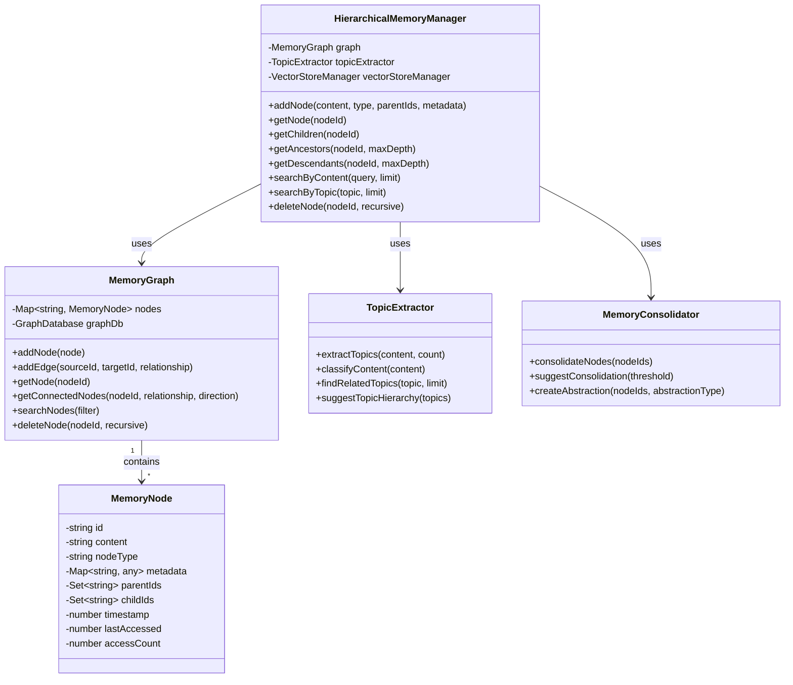

#### API Specification

**Hierarchical Memory API**

```typescript
interface HierarchicalMemoryAPI {
  // Add a new node to the memory
  addNode(
    content: string,
    nodeType: string,
    parentIds?: string[],
    metadata?: Record<string, any>
  ): Promise<string>;
  
  // Get a node by ID
  getNode(nodeId: string): Promise<MemoryNode>;
  
  // Get children of a node
  getChildren(
    nodeId: string,
    filter?: NodeFilter
  ): Promise<MemoryNode[]>;
  
  // Get parents of a node
  getParents(
    nodeId: string,
    filter?: NodeFilter
  ): Promise<MemoryNode[]>;
  
  // Get ancestors of a node
  getAncestors(
    nodeId: string,
    maxDepth?: number,
    filter?: NodeFilter
  ): Promise<MemoryNode[]>;
  
  // Get descendants of a node
  getDescendants(
    nodeId: string,
    maxDepth?: number,
    filter?: NodeFilter
  ): Promise<MemoryNode[]>;
  
  // Search nodes by content
  searchByContent(
    query: string,
    limit?: number,
    filter?: NodeFilter
  ): Promise<SearchResult[]>;
  
  // Search nodes by topic
  searchByTopic(
    topic: string,
    limit?: number,
    filter?: NodeFilter
  ): Promise<SearchResult[]>;
  
  // Delete a node
  deleteNode(
    nodeId: string,
    recursive?: boolean
  ): Promise<boolean>;
  
  // Extract topics from content
  extractTopics(
    content: string,
    count?: number
  ): Promise<Topic[]>;
  
  // Consolidate nodes
  consolidateNodes(
    nodeIds: string[],
    options?: ConsolidationOptions
  ): Promise<string>;
}

interface MemoryNode {
  id: string;
  content: string;
  nodeType: string;
  metadata: Record<string, any>;
  parentIds: string[];
  childIds: string[];
  created: Date;
  lastAccessed: Date;
  accessCount: number;
}

interface NodeFilter {
  nodeTypes?: string[];
  minImportance?: number;
  dateRange?: {
    start?: Date;
    end?: Date;
  };
  metadata?: Record<string, any>;
}

interface SearchResult {
  node: MemoryNode;
  score: number;
  matchType: 'content' | 'topic' | 'metadata';
}

interface Topic {
  name: string;
  score: number;
  subtopics?: Topic[];
}

interface ConsolidationOptions {
  title?: string;
  abstractionLevel?: 'low' | 'medium' | 'high';
  preserveOriginal?: boolean;
  nodeType?: string;
}
```

#### Data Model

**Memory Node**

```json
{
  "id": "node_1234567890",
  "content": "The capital of France is Paris. It is known for the Eiffel Tower and the Louvre Museum.",
  "nodeType": "fact",
  "metadata": {
    "source": "conversation",
    "conversationId": "conv_1234567890",
    "timestamp": "2025-04-21T12:34:56Z",
    "importance": 0.85,
    "topics": ["geography", "france", "paris", "capital"],
    "confidence": 0.98
  },
  "parentIds": ["node_abcdef123"],
  "childIds": ["node_456789abc", "node_def123456"],
  "created": "2025-04-21T12:34:56Z",
  "lastAccessed": "2025-04-21T14:45:12Z",
  "accessCount": 5
}
```

**Topic Hierarchy**

```json
{
  "id": "topic_geography",
  "name": "Geography",
  "nodeType": "topic",
  "metadata": {
    "description": "Information about geographical locations and features",
    "importance": 0.9
  },
  "childIds": ["topic_countries", "topic_cities", "topic_landmarks"],
  "created": "2025-04-01T00:00:00Z",
  "lastAccessed": "2025-04-21T12:34:56Z",
  "accessCount": 25,
  "relatedNodes": [
    {
      "nodeId": "node_1234567890",
      "relationship": "contains",
      "strength": 0.85
    },
    {
      "nodeId": "node_abcdef123",
      "relationship": "contains",
      "strength": 0.75
    }
  ]
}
```

## 3. Security System

### 3.1 Authentication Service

#### Component Design

The Authentication Service provides secure user authentication with multi-factor authentication and OAuth integration.

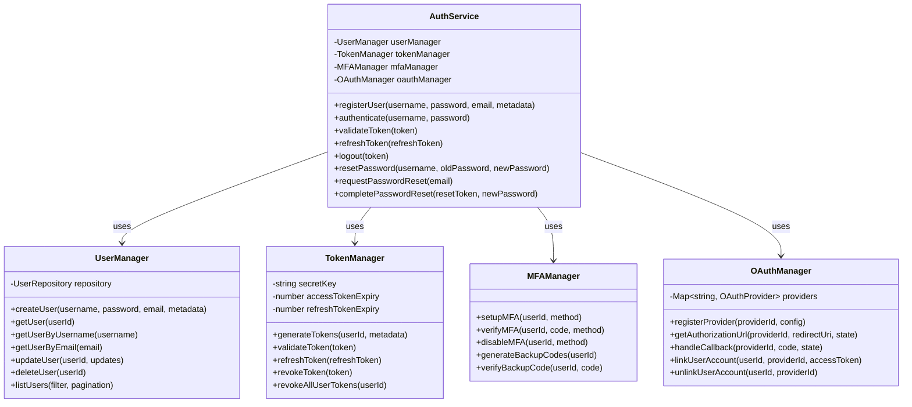

#### API Specification

**Authentication API**

```typescript
interface AuthenticationAPI {
  // Register a new user
  registerUser(
    username: string,
    password: string,
    email: string,
    metadata?: Record<string, any>
  ): Promise<UserRegistrationResult>;
  
  // Authenticate a user
  authenticate(
    username: string,
    password: string,
    mfaCode?: string
  ): Promise<AuthenticationResult>;
  
  // Validate a token
  validateToken(
    token: string
  ): Promise<TokenValidationResult>;
  
  // Refresh a token
  refreshToken(
    refreshToken: string
  ): Promise<TokenRefreshResult>;
  
  // Logout (invalidate token)
  logout(
    token: string
  ): Promise<LogoutResult>;
  
  // Reset password
  resetPassword(
    username: string,
    oldPassword: string,
    newPassword: string
  ): Promise<PasswordResetResult>;
  
  // Request password reset
  requestPasswordReset(
    email: string
  ): Promise<PasswordResetRequestResult>;
  
  // Complete password reset
  completePasswordReset(
    resetToken: string,
    newPassword: string
  ): Promise<PasswordResetResult>;
  
  // Setup MFA
  setupMFA(
    userId: string,
    method: MFAMethod
  ): Promise<MFASetupResult>;
  
  // Verify MFA
  verifyMFA(
    userId: string,
    code: string,
    method: MFAMethod
  ): Promise<MFAVerificationResult>;
  
  // OAuth authorization URL
  getOAuthAuthorizationUrl(
    providerId: string,
    redirectUri: string,
    state?: string
  ): Promise<OAuthAuthorizationUrlResult>;
  
  // Handle OAuth callback
  handleOAuthCallback(
    providerId: string,
    code: string,
    state?: string
  ): Promise<OAuthCallbackResult>;
}

interface UserRegistrationResult {
  success: boolean;
  userId?: string;
  message: string;
}

interface AuthenticationResult {
  success: boolean;
  accessToken?: string;
  refreshToken?: string;
  expiresIn?: number;
  user?: UserInfo;
  requiresMFA?: boolean;
  mfaMethods?: MFAMethod[];
  message?: string;
}

interface TokenValidationResult {
  valid: boolean;
  userId?: string;
  username?: string;
  metadata?: Record<string, any>;
  message?: string;
}

interface TokenRefreshResult {
  success: boolean;
  accessToken?: string;
  refreshToken?: string;
  expiresIn?: number;
  message?: string;
}

interface LogoutResult {
  success: boolean;
  message: string;
}

interface PasswordResetResult {
  success: boolean;
  message: string;
}

interface PasswordResetRequestResult {
  success: boolean;
  message: string;
}

interface MFASetupResult {
  success: boolean;
  setupData?: Record<string, any>;
  backupCodes?: string[];
  message?: string;
}

interface MFAVerificationResult {
  success: boolean;
  message: string;
}

interface OAuthAuthorizationUrlResult {
  url: string;
  state: string;
}

interface OAuthCallbackResult {
  success: boolean;
  accessToken?: string;
  refreshToken?: string;
  user?: UserInfo;
  message?: string;
}

type MFAMethod = 'totp' | 'sms' | 'email' | 'backup_code';

interface UserInfo {
  id: string;
  username: string;
  email: string;
  roles: string[];
  metadata: Record<string, any>;
}
```

#### Data Model

**User Record**

```json
{
  "id": "user_1234567890",
  "username": "johndoe",
  "email": "john.doe@example.com",
  "passwordHash": "$2b$10$X7Rw1LX8ZQI5P0Q5XJH5QO1J5T9E5K1S1K1S1K1S1K1S1K1S1K",
  "salt": "X7Rw1LX8ZQI5P0Q5XJH5QO",
  "roles": ["user"],
  "mfa": {
    "enabled": true,
    "methods": ["totp"],
    "totp": {
      "secret": "JBSWY3DPEHPK3PXP",
      "verified": true
    },
    "backupCodes": [
      {
        "code": "$2b$10$X7Rw1LX8ZQI5P0Q5XJH5QO1J5T9E5K1S1K1S1K1S1K1S1K1S1K",
        "used": false
      },
      {
        "code": "$2b$10$X7Rw1LX8ZQI5P0Q5XJH5QO1J5T9E5K1S1K1S1K1S1K1S1K1S1K",
        "used": false
      }
    ]
  },
  "oauth": {
    "google": {
      "id": "google_user_id",
      "email": "john.doe@gmail.com",
      "connected": "2025-04-01T00:00:00Z"
    }
  },
  "metadata": {
    "firstName": "John",
    "lastName": "Doe",
    "company": "Acme Inc.",
    "preferences": {
      "theme": "dark",
      "language": "en"
    }
  },
  "status": "active",
  "created": "2025-04-01T00:00:00Z",
  "lastLogin": "2025-04-21T12:34:56Z",
  "lastUpdated": "2025-04-21T12:34:56Z"
}
```

**Token Record**

```json
{
  "id": "token_1234567890",
  "userId": "user_1234567890",
  "accessToken": "eyJhbGciOiJIUzI1NiIsInR5cCI6IkpXVCJ9...",
  "refreshToken": "eyJhbGciOiJIUzI1NiIsInR5cCI6IkpXVCJ9...",
  "accessTokenExpires": "2025-04-21T13:34:56Z",
  "refreshTokenExpires": "2025-04-28T12:34:56Z",
  "clientInfo": {
    "ip": "192.168.1.1",
    "userAgent": "Mozilla/5.0 (Windows NT 10.0; Win64; x64) AppleWebKit/537.36 (KHTML, like Gecko) Chrome/91.0.4472.124 Safari/537.36",
    "device": "desktop"
  },
  "created": "2025-04-21T12:34:56Z",
  "lastUsed": "2025-04-21T12:45:12Z"
}
```

### 3.2 Authorization Framework

#### Component Design

The Authorization Framework provides attribute-based access control with dynamic policy evaluation.

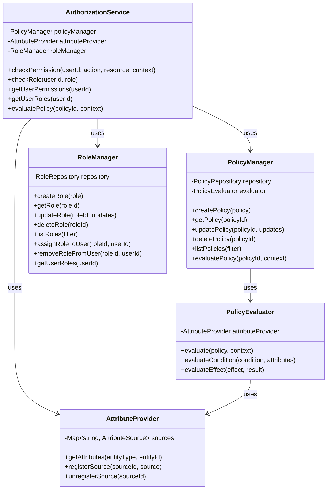

#### API Specification

**Authorization API**

```typescript
interface AuthorizationAPI {
  // Check if a user has permission to perform an action on a resource
  checkPermission(
    userId: string,
    action: string,
    resource: string,
    context?: Record<string, any>
  ): Promise<PermissionCheckResult>;
  
  // Check if a user has a role
  checkRole(
    userId: string,
    role: string
  ): Promise<RoleCheckResult>;
  
  // Get all permissions for a user
  getUserPermissions(
    userId: string
  ): Promise<Permission[]>;
  
  // Get all roles for a user
  getUserRoles(
    userId: string
  ): Promise<Role[]>;
  
  // Evaluate a policy
  evaluatePolicy(
    policyId: string,
    context: Record<string, any>
  ): Promise<PolicyEvaluationResult>;
  
  // Create a policy
  createPolicy(
    policy: Policy
  ): Promise<PolicyCreationResult>;
  
  // Create a role
  createRole(
    role: Role
  ): Promise<RoleCreationResult>;
  
  // Assign a role to a user
  assignRoleToUser(
    roleId: string,
    userId: string
  ): Promise<RoleAssignmentResult>;
  
  // Remove a role from a user
  removeRoleFromUser(
    roleId: string,
    userId: string
  ): Promise<RoleRemovalResult>;
}

interface PermissionCheckResult {
  allowed: boolean;
  reason?: string;
  policy?: string;
}

interface RoleCheckResult {
  hasRole: boolean;
}

interface Permission {
  id: string;
  name: string;
  description?: string;
  resource: string;
  action: string;
}

interface Role {
  id: string;
  name: string;
  description?: string;
  permissions: string[];
}

interface Policy {
  id?: string;
  name: string;
  description?: string;
  effect: 'allow' | 'deny';
  actions: string[];
  resources: string[];
  conditions?: PolicyCondition[];
}

interface PolicyCondition {
  attribute: string;
  operator: 'eq' | 'ne' | 'gt' | 'lt' | 'in' | 'contains' | 'startsWith' | 'endsWith';
  value: any;
}

interface PolicyEvaluationResult {
  allowed: boolean;
  policy: string;
  evaluatedConditions: {
    condition: PolicyCondition;
    result: boolean;
    attributes: Record<string, any>;
  }[];
}

interface PolicyCreationResult {
  success: boolean;
  policyId?: string;
  message?: string;
}

interface RoleCreationResult {
  success: boolean;
  roleId?: string;
  message?: string;
}

interface RoleAssignmentResult {
  success: boolean;
  message?: string;
}

interface RoleRemovalResult {
  success: boolean;
  message?: string;
}
```

#### Data Model

**Policy Definition**

```json
{
  "id": "policy_1234567890",
  "name": "Document Access Policy",
  "description": "Controls access to documents based on ownership and sharing",
  "effect": "allow",
  "actions": ["document:read", "document:list"],
  "resources": ["document/*"],
  "conditions": [
    {
      "attribute": "resource.owner",
      "operator": "eq",
      "value": "${principal.id}"
    },
    {
      "attribute": "resource.sharedWith",
      "operator": "contains",
      "value": "${principal.id}"
    }
  ],
  "metadata": {
    "version": 1,
    "created": "2025-04-01T00:00:00Z",
    "lastUpdated": "2025-04-21T12:34:56Z",
    "createdBy": "admin"
  }
}
```

**Role Definition**

```json
{
  "id": "role_1234567890",
  "name": "Document Editor",
  "description": "Can create and edit documents",
  "permissions": [
    "document:create",
    "document:read",
    "document:update",
    "document:list"
  ],
  "metadata": {
    "version": 1,
    "created": "2025-04-01T00:00:00Z",
    "lastUpdated": "2025-04-21T12:34:56Z",
    "createdBy": "admin"
  }
}
```

**User Role Assignment**

```json
{
  "userId": "user_1234567890",
  "roles": [
    {
      "roleId": "role_1234567890",
      "name": "Document Editor",
      "assignedAt": "2025-04-01T00:00:00Z",
      "assignedBy": "admin",
      "expiresAt": null
    },
    {
      "roleId": "role_abcdef123",
      "name": "Project Viewer",
      "assignedAt": "2025-04-15T00:00:00Z",
      "assignedBy": "manager",
      "expiresAt": "2025-05-15T00:00:00Z"
    }
  ]
}
```

## 4. UI Components

### 4.1 Real-Time Visualization Framework

#### Component Design

The Real-Time Visualization Framework provides components for visualizing agent activities and thought processes in real-time.

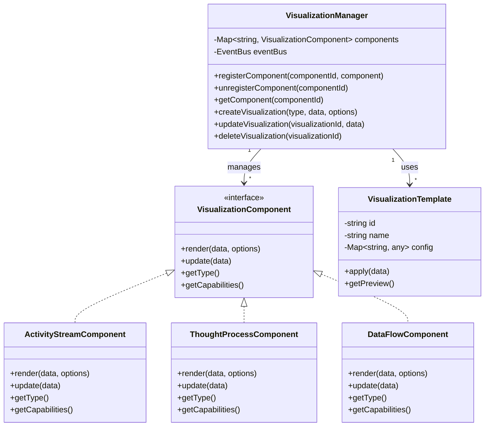

#### API Specification

**Visualization API**

```typescript
interface VisualizationAPI {
  // Register a visualization component
  registerComponent(
    componentId: string,
    component: VisualizationComponent
  ): Promise<void>;
  
  // Create a visualization
  createVisualization(
    type: string,
    data: any,
    options?: VisualizationOptions
  ): Promise<VisualizationResult>;
  
  // Update a visualization
  updateVisualization(
    visualizationId: string,
    data: any
  ): Promise<VisualizationResult>;
  
  // Delete a visualization
  deleteVisualization(
    visualizationId: string
  ): Promise<boolean>;
  
  // Get available visualization types
  getVisualizationTypes(): Promise<VisualizationTypeInfo[]>;
  
  // Get visualization templates
  getVisualizationTemplates(
    type?: string
  ): Promise<VisualizationTemplate[]>;
  
  // Apply a template to data
  applyTemplate(
    templateId: string,
    data: any
  ): Promise<VisualizationResult>;
}

interface VisualizationComponent {
  // Render the component with data
  render(
    data: any,
    options?: VisualizationOptions
  ): Promise<VisualizationResult>;
  
  // Update the component with new data
  update(
    data: any
  ): Promise<VisualizationResult>;
  
  // Get the component type
  getType(): string;
  
  // Get the component capabilities
  getCapabilities(): VisualizationCapabilities;
}

interface VisualizationOptions {
  template?: string;
  width?: number;
  height?: number;
  theme?: 'light' | 'dark' | 'system';
  interactive?: boolean;
  animationDuration?: number;
  [key: string]: any;
}

interface VisualizationResult {
  id: string;
  type: string;
  data: any;
  renderedContent: any;
  metadata: {
    created: Date;
    updated: Date;
    [key: string]: any;
  };
}

interface VisualizationTypeInfo {
  type: string;
  name: string;
  description: string;
  capabilities: VisualizationCapabilities;
  supportedDataTypes: string[];
  exampleData: any;
}

interface VisualizationCapabilities {
  interactive: boolean;
  animated: boolean;
  streaming: boolean;
  exportFormats: string[];
  [key: string]: any;
}

interface VisualizationTemplate {
  id: string;
  name: string;
  description: string;
  type: string;
  preview: string;
  config: Record<string, any>;
}
```

#### Data Model

**Visualization Configuration**

```json
{
  "id": "vis_1234567890",
  "type": "activity_stream",
  "name": "Agent Activity Stream",
  "description": "Real-time visualization of agent activities",
  "config": {
    "template": "timeline",
    "width": 800,
    "height": 600,
    "theme": "dark",
    "interactive": true,
    "animationDuration": 300,
    "groupBy": "category",
    "showTimestamps": true,
    "maxItems": 50,
    "refreshInterval": 1000
  },
  "data": {
    "source": "event_stream",
    "filter": {
      "types": ["agent_action", "agent_thought", "user_interaction"],
      "minImportance": 0.5
    },
    "mapping": {
      "id": "$.id",
      "timestamp": "$.timestamp",
      "title": "$.description",
      "category": "$.type",
      "importance": "$.metadata.importance"
    }
  },
  "metadata": {
    "created": "2025-04-21T12:00:00Z",
    "updated": "2025-04-21T12:34:56Z",
    "createdBy": "user_1234567890"
  }
}
```

**Visualization Template**

```json
{
  "id": "template_timeline",
  "name": "Interactive Timeline",
  "description": "A timeline visualization with interactive elements",
  "type": "activity_stream",
  "preview": "data:image/png;base64,...",
  "config": {
    "layout": "vertical",
    "itemSpacing": 10,
    "showIcons": true,
    "colorScheme": {
      "agent_action": "#4285F4",
      "agent_thought": "#34A853",
      "user_interaction": "#FBBC05"
    },
    "animations": {
      "enter": {
        "type": "fade",
        "duration": 300
      },
      "update": {
        "type": "slide",
        "duration": 200
      },
      "exit": {
        "type": "fade",
        "duration": 200
      }
    },
    "interactions": {
      "click": {
        "action": "expand",
        "target": "details"
      },
      "hover": {
        "action": "highlight",
        "target": "item"
      }
    }
  }
}
```

### 4.2 Collaborative Editing System

#### Component Design

The Collaborative Editing System provides real-time collaborative editing with conflict resolution.

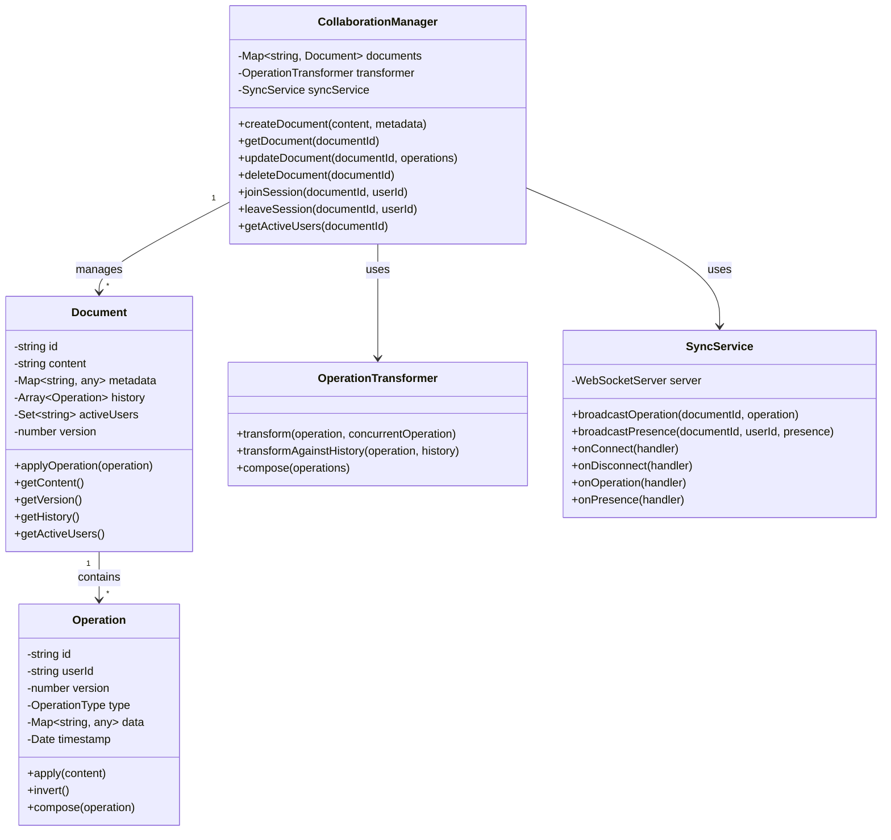

#### API Specification

**Collaborative Editing API**

```typescript
interface CollaborativeEditingAPI {
  // Create a new document
  createDocument(
    content: string,
    metadata?: Record<string, any>
  ): Promise<DocumentCreationResult>;
  
  // Get a document
  getDocument(
    documentId: string
  ): Promise<Document>;
  
  // Update a document with operations
  updateDocument(
    documentId: string,
    operations: Operation[]
  ): Promise<DocumentUpdateResult>;
  
  // Delete a document
  deleteDocument(
    documentId: string
  ): Promise<boolean>;
  
  // Join a collaborative session
  joinSession(
    documentId: string,
    userId: string,
    metadata?: Record<string, any>
  ): Promise<SessionJoinResult>;
  
  // Leave a collaborative session
  leaveSession(
    documentId: string,
    userId: string
  ): Promise<boolean>;
  
  // Get active users in a session
  getActiveUsers(
    documentId: string
  ): Promise<ActiveUser[]>;
  
  // Subscribe to document changes
  subscribeToChanges(
    documentId: string,
    callback: (operation: Operation) => void
  ): Promise<Subscription>;
  
  // Subscribe to presence updates
  subscribeToPresence(
    documentId: string,
    callback: (presence: PresenceUpdate) => void
  ): Promise<Subscription>;
}

interface Document {
  id: string;
  content: string;
  metadata: Record<string, any>;
  version: number;
  createdAt: Date;
  updatedAt: Date;
  createdBy: string;
}

interface Operation {
  id: string;
  userId: string;
  documentId: string;
  version: number;
  type: OperationType;
  data: OperationData;
  timestamp: Date;
}

type OperationType = 'insert' | 'delete' | 'retain' | 'format' | 'composite';

interface OperationData {
  position?: number;
  length?: number;
  text?: string;
  attributes?: Record<string, any>;
  operations?: Operation[];
}

interface DocumentCreationResult {
  success: boolean;
  documentId?: string;
  document?: Document;
  message?: string;
}

interface DocumentUpdateResult {
  success: boolean;
  version: number;
  operations: Operation[];
  conflicts?: Operation[];
  message?: string;
}

interface SessionJoinResult {
  success: boolean;
  sessionId: string;
  document: Document;
  activeUsers: ActiveUser[];
  message?: string;
}

interface ActiveUser {
  userId: string;
  joinedAt: Date;
  metadata: Record<string, any>;
  presence?: UserPresence;
}

interface UserPresence {
  cursor?: {
    position: number;
    selection?: {
      start: number;
      end: number;
    };
  };
  lastActive: Date;
  metadata: Record<string, any>;
}

interface PresenceUpdate {
  documentId: string;
  userId: string;
  presence: UserPresence;
  timestamp: Date;
}

interface Subscription {
  id: string;
  unsubscribe: () => void;
}
```

#### Data Model

**Document**

```json
{
  "id": "doc_1234567890",
  "content": "# Collaborative Document\n\nThis is a collaborative document that can be edited by multiple users simultaneously.",
  "metadata": {
    "title": "Collaborative Document",
    "description": "A sample collaborative document",
    "tags": ["sample", "collaboration"],
    "permissions": {
      "owner": "user_1234567890",
      "editors": ["user_abcdef123", "user_456789abc"],
      "viewers": ["user_def123456"]
    }
  },
  "version": 15,
  "history": [
    {
      "id": "op_1234567890",
      "userId": "user_1234567890",
      "version": 1,
      "type": "insert",
      "data": {
        "position": 0,
        "text": "# Collaborative Document\n\n"
      },
      "timestamp": "2025-04-21T12:00:00Z"
    },
    {
      "id": "op_abcdef123",
      "userId": "user_1234567890",
      "version": 2,
      "type": "insert",
      "data": {
        "position": 24,
        "text": "This is a collaborative document."
      },
      "timestamp": "2025-04-21T12:01:00Z"
    },
    {
      "id": "op_456789abc",
      "userId": "user_abcdef123",
      "version": 3,
      "type": "insert",
      "data": {
        "position": 58,
        "text": " that can be edited by multiple users simultaneously"
      },
      "timestamp": "2025-04-21T12:02:00Z"
    }
  ],
  "activeUsers": [
    {
      "userId": "user_1234567890",
      "joinedAt": "2025-04-21T12:00:00Z",
      "metadata": {
        "name": "John Doe",
        "color": "#4285F4"
      },
      "presence": {
        "cursor": {
          "position": 58,
          "selection": {
            "start": 58,
            "end": 58
          }
        },
        "lastActive": "2025-04-21T12:34:56Z"
      }
    },
    {
      "userId": "user_abcdef123",
      "joinedAt": "2025-04-21T12:01:30Z",
      "metadata": {
        "name": "Jane Smith",
        "color": "#34A853"
      },
      "presence": {
        "cursor": {
          "position": 100,
          "selection": {
            "start": 90,
            "end": 110
          }
        },
        "lastActive": "2025-04-21T12:33:45Z"
      }
    }
  ],
  "createdAt": "2025-04-21T12:00:00Z",
  "updatedAt": "2025-04-21T12:34:56Z",
  "createdBy": "user_1234567890"
}
```

**Operation**

```json
{
  "id": "op_1234567890",
  "userId": "user_1234567890",
  "documentId": "doc_1234567890",
  "version": 16,
  "type": "insert",
  "data": {
    "position": 110,
    "text": "."
  },
  "timestamp": "2025-04-21T12:34:56Z"
}
```

## 5. Integration Patterns

### 5.1 Event-Driven Architecture

#### Component Design

The Event-Driven Architecture provides a robust foundation for asynchronous communication between services.

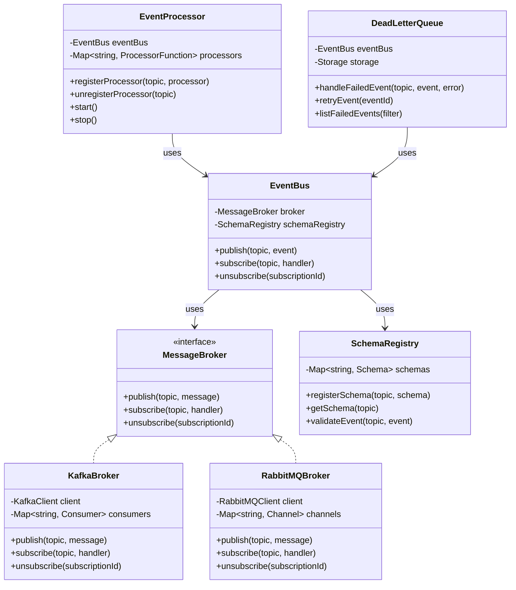

#### API Specification

**Event Bus API**

```typescript
interface EventBusAPI {
  // Publish an event to a topic
  publish<T>(
    topic: string,
    event: T,
    options?: PublishOptions
  ): Promise<PublishResult>;
  
  // Subscribe to a topic
  subscribe<T>(
    topic: string,
    handler: (event: T, metadata: EventMetadata) => Promise<void>,
    options?: SubscribeOptions
  ): Promise<Subscription>;
  
  // Unsubscribe from a topic
  unsubscribe(
    subscriptionId: string
  ): Promise<boolean>;
  
  // Register a schema for a topic
  registerSchema(
    topic: string,
    schema: Schema
  ): Promise<void>;
  
  // Get a schema for a topic
  getSchema(
    topic: string
  ): Promise<Schema>;
  
  // Validate an event against a schema
  validateEvent<T>(
    topic: string,
    event: T
  ): Promise<ValidationResult>;
}

interface PublishOptions {
  partitionKey?: string;
  headers?: Record<string, string>;
  priority?: 'high' | 'normal' | 'low';
  delay?: number;
  ttl?: number;
}

interface PublishResult {
  success: boolean;
  eventId: string;
  topic: string;
  timestamp: Date;
  partition?: number;
  offset?: number;
}

interface SubscribeOptions {
  groupId?: string;
  fromBeginning?: boolean;
  batchSize?: number;
  maxRetries?: number;
  retryDelay?: number;
  deadLetterTopic?: string;
  filter?: EventFilter;
}

interface EventMetadata {
  eventId: string;
  topic: string;
  timestamp: Date;
  publisher: string;
  headers: Record<string, string>;
  partition?: number;
  offset?: number;
}

interface EventFilter {
  headerMatches?: Record<string, string>;
  contentMatches?: Record<string, any>;
}

interface Schema {
  type: 'json-schema' | 'avro' | 'protobuf';
  definition: any;
  version: number;
}

interface ValidationResult {
  valid: boolean;
  errors?: ValidationError[];
}

interface ValidationError {
  path: string;
  message: string;
}

interface Subscription {
  id: string;
  topic: string;
  unsubscribe: () => Promise<boolean>;
}
```

#### Data Model

**Event Schema**

```json
{
  "topic": "user.created",
  "schema": {
    "type": "json-schema",
    "definition": {
      "$schema": "http://json-schema.org/draft-07/schema#",
      "type": "object",
      "required": ["userId", "username", "email", "timestamp"],
      "properties": {
        "userId": {
          "type": "string",
          "pattern": "^user_[a-zA-Z0-9]{10}$"
        },
        "username": {
          "type": "string",
          "minLength": 3,
          "maxLength": 50
        },
        "email": {
          "type": "string",
          "format": "email"
        },
        "metadata": {
          "type": "object"
        },
        "timestamp": {
          "type": "string",
          "format": "date-time"
        }
      }
    },
    "version": 1
  },
  "metadata": {
    "description": "Event emitted when a new user is created",
    "owner": "auth-service",
    "created": "2025-04-01T00:00:00Z",
    "updated": "2025-04-01T00:00:00Z"
  }
}
```

**Event Message**

```json
{
  "eventId": "evt_1234567890",
  "topic": "user.created",
  "data": {
    "userId": "user_1234567890",
    "username": "johndoe",
    "email": "john.doe@example.com",
    "metadata": {
      "firstName": "John",
      "lastName": "Doe",
      "source": "web-signup"
    },
    "timestamp": "2025-04-21T12:34:56Z"
  },
  "metadata": {
    "publisher": "auth-service",
    "timestamp": "2025-04-21T12:34:56Z",
    "headers": {
      "correlation-id": "corr_1234567890",
      "content-type": "application/json"
    },
    "partition": 3,
    "offset": 1234567
  }
}
```

### 5.2 API Gateway Integration

#### Component Design

The API Gateway provides a unified entry point for all services with authentication, routing, and rate limiting.

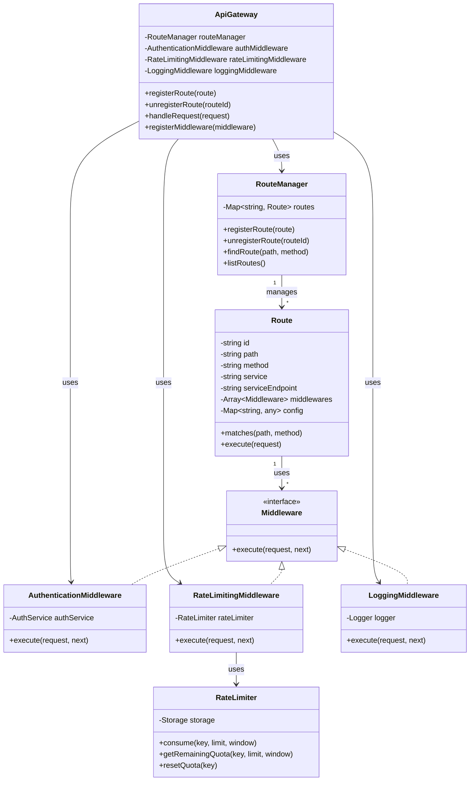

#### API Specification

**API Gateway API**

```typescript
interface ApiGatewayAPI {
  // Register a route
  registerRoute(
    route: Route
  ): Promise<RouteRegistrationResult>;
  
  // Unregister a route
  unregisterRoute(
    routeId: string
  ): Promise<boolean>;
  
  // Get a route by ID
  getRoute(
    routeId: string
  ): Promise<Route>;
  
  // List all routes
  listRoutes(
    filter?: RouteFilter
  ): Promise<Route[]>;
  
  // Register a middleware
  registerMiddleware(
    middleware: Middleware
  ): Promise<MiddlewareRegistrationResult>;
  
  // Get rate limit status
  getRateLimitStatus(
    key: string
  ): Promise<RateLimitStatus>;
  
  // Reset rate limit
  resetRateLimit(
    key: string
  ): Promise<boolean>;
}

interface Route {
  id?: string;
  path: string;
  method: string;
  service: string;
  serviceEndpoint: string;
  middlewares?: string[];
  config?: {
    timeout?: number;
    retries?: number;
    caching?: {
      enabled: boolean;
      ttl: number;
    };
    rateLimit?: {
      limit: number;
      window: number;
    };
    authentication?: {
      required: boolean;
      scopes?: string[];
    };
    [key: string]: any;
  };
}

interface RouteFilter {
  service?: string;
  method?: string;
  pathPattern?: string;
  requiresAuth?: boolean;
}

interface RouteRegistrationResult {
  success: boolean;
  routeId?: string;
  message?: string;
}

interface Middleware {
  id?: string;
  name: string;
  type: string;
  config?: Record<string, any>;
  priority: number;
}

interface MiddlewareRegistrationResult {
  success: boolean;
  middlewareId?: string;
  message?: string;
}

interface RateLimitStatus {
  key: string;
  limit: number;
  remaining: number;
  reset: Date;
  window: number;
}
```

#### Data Model

**Route Configuration**

```json
{
  "id": "route_1234567890",
  "path": "/api/v1/users/:userId",
  "method": "GET",
  "service": "user-service",
  "serviceEndpoint": "/users/:userId",
  "middlewares": ["auth", "rate-limit", "logging"],
  "config": {
    "timeout": 5000,
    "retries": 3,
    "caching": {
      "enabled": true,
      "ttl": 300
    },
    "rateLimit": {
      "limit": 100,
      "window": 60
    },
    "authentication": {
      "required": true,
      "scopes": ["users:read"]
    },
    "transformations": {
      "request": {
        "headers": {
          "add": {
            "X-Internal-Service": "api-gateway"
          },
          "remove": ["X-Forwarded-For"]
        }
      },
      "response": {
        "headers": {
          "add": {
            "X-Response-Time": "${responseTime}"
          }
        }
      }
    }
  },
  "metadata": {
    "created": "2025-04-01T00:00:00Z",
    "updated": "2025-04-21T12:34:56Z",
    "createdBy": "admin"
  }
}
```

**Middleware Configuration**

```json
{
  "id": "middleware_1234567890",
  "name": "Authentication Middleware",
  "type": "authentication",
  "config": {
    "tokenLocation": "header",
    "headerName": "Authorization",
    "tokenPrefix": "Bearer",
    "ignoreExpiration": false,
    "cacheValidation": true,
    "cacheTtl": 60
  },
  "priority": 100,
  "metadata": {
    "created": "2025-04-01T00:00:00Z",
    "updated": "2025-04-01T00:00:00Z",
    "createdBy": "admin"
  }
}
```

## 6. Implementation Timeline

### 6.1 Phase 1: Foundation (Months 1-3)

**Month 1: Architecture Setup**
- Week 1-2: Set up microservices infrastructure
- Week 3-4: Implement API gateway and service discovery

**Month 2: Core Services**
- Week 1-2: Implement enhanced provider registry
- Week 3-4: Develop unified streaming protocol

**Month 3: Security Foundation**
- Week 1-2: Implement authentication service
- Week 3-4: Set up observability platform

### 6.2 Phase 2: Advanced Features (Months 4-6)

**Month 4: Memory System**
- Week 1-2: Implement vector database integration
- Week 3-4: Develop neural context compression

**Month 5: UI Components**
- Week 1-2: Implement real-time visualization framework
- Week 3-4: Develop collaborative editing system

**Month 6: Security Enhancements**
- Week 1-2: Implement advanced authorization framework
- Week 3-4: Develop end-to-end encryption

### 6.3 Phase 3: Innovation (Months 7-9)

**Month 7: Tool Integration**
- Week 1-2: Implement tool integration framework
- Week 3-4: Develop sandboxed execution environment

**Month 8: Advanced Computer Control**
- Week 1-2: Implement computer vision-based element recognition
- Week 3-4: Develop OCR capabilities

**Month 9: Learning System**
- Week 1-2: Implement feedback collection and analysis
- Week 3-4: Develop adaptive learning mechanisms

## 7. Conclusion

These technical specifications provide a detailed blueprint for implementing the improvements identified for the Lumina AI system. The specifications cover all major components, including the provider integration layer, memory system, security system, UI components, and integration patterns.

By following these specifications, the development team can implement a robust, scalable, and feature-rich system that addresses the current limitations and provides a solid foundation for future enhancements.

The phased implementation approach allows for incremental improvements while maintaining system stability, and the focus on cross-cutting concerns ensures that the system remains robust and maintainable as it grows in complexity.
